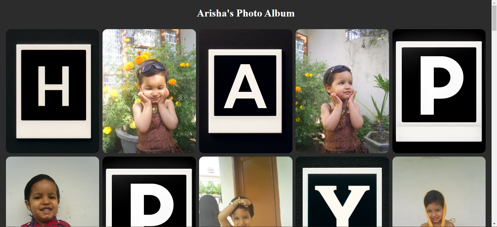

# Arisha's Photo Album 📷

A personalized photo album web application created as a birthday gift for Arisha. This project allows Arisha to browse through a collection of her favorite photos in a visually appealing manner.

## Preview



## Features

- **Responsive Design**: The web application is designed to be responsive, ensuring a seamless experience across various devices and screen sizes.

- **Interactive Photo Album**: Arisha can click on any photo to view it in full size and easily navigate back to the main album page.

## Technologies Used

- **Flask**: The web application is built using Flask, a lightweight web framework for Python.

- **HTML & CSS**: HTML and CSS are used to structure and style the web pages, providing an attractive layout and design.

- **Jinja2 Templating**: Jinja2 templating engine is used for dynamic content rendering in Flask templates.

## Deployment

The project is deployed on [Render](https://arishas-photo-album.onrender.com/), allowing Arisha to access her photo album from anywhere.

## Getting Started

To run the project locally, follow these steps:

1. Clone this repository:
```bash
git clone https://github.com/your-username/arishas-photo-album.git
```

1. Install the required dependencies:
  ```bash
  pip install -r requirements.txt
  ```

1. Run the Flask application:
  ```bash
  python app.py
  ```

4. Open your web browser and navigate to http://localhost:5000 to view the photo album.

## Contributing

Contributions are welcome! If you have any ideas for improvement or new features, feel free to open an issue or submit a pull request.
